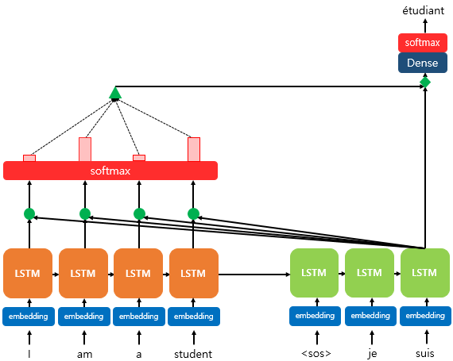
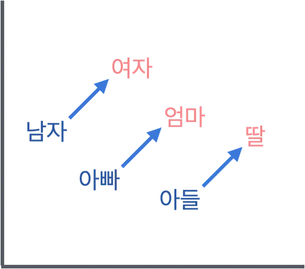
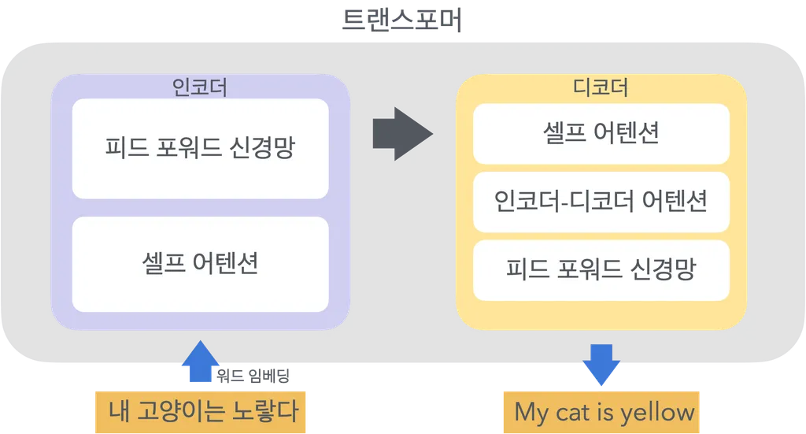
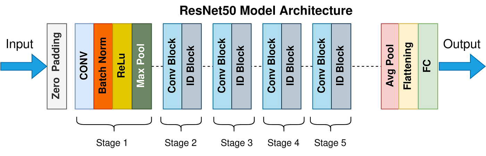
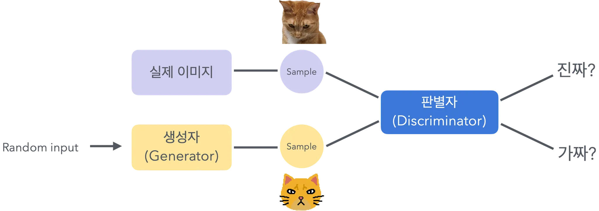
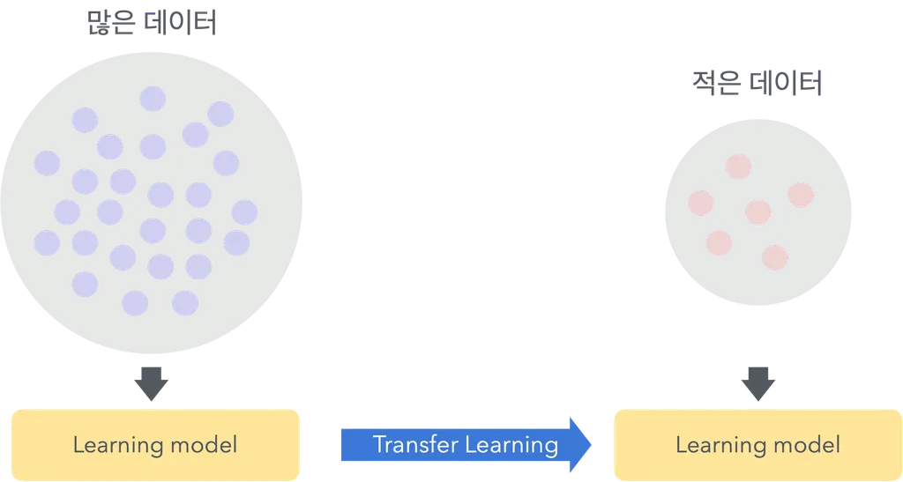

## [ 어텐션 메커니즘 ]

(Self-Attention)

- **시퀀스 데이터**에서 중요한 부분에 더 많은 가중치를 할당해 정보 효율적으로 처리하는 기법
- 자연어 처리, 시계열 데이터에서 사용되며 *뛰어난 성능*을 발휘함
&nbsp;
- 핵심
    - Query : 질문
    - Key : 답
    - Value : 최종 요약
&nbsp;
- **동작 방식**
    - 입력 시퀀스의 각 요소에 대해 중요도 계산해 가중치 부여 → 중요한 정보에 집중하고 불필요한 정보는 무시할 수 있음
    - 중요도 ⇒ **Attention Score**
        - Query와 Key 간의 유사도 측정해 중요도 계산
        - *내적* 등을 사용하여 계산할 수 있음
        - **Softmax를 통한 가중치 계산**
            - $\alpha_i = \frac{\exp(\text{score}(Q, K_i))}{\sum_{j} \exp(\text{score}(Q, K_j))}$
            - 가중치의 합이 **1** 이 되도록 계산
    - $\text{Attention}(Q, K, V) = \sum_{i} \alpha_i V_i$
        - 계산한 가중치를 Value에 곱해 최종 Attention 출력 계산
        &nbsp;
- **Multi-Head Attention**
    - 여러 개의 Self-Attention을 병렬로 수행
    - 각 헤드는 서로 다른 부분의 정보 학습
&nbsp;
## [ 자연어 처리(NLP) 모델 ]

### **[ 워드 임베딩 기법 ]**

- 단어를 고정된 크기의 벡터로 변환하는 기법
- 단어 간의 의미적 유사성 반영
- 1 ) **Word2Vec**
    - 단어를 벡터로 변환하는 모델 제공
    - [ 1 ] **CBOW** : 주변 단어로 중심 단어 예측
    - [ 2 ] **Skip-gram** : 중심 단어로 주변 단어 예측
    
- 2 ) **GloVe**
    - 단어-단어 공기행렬 사용해 단어 벡터 학습
    - 전역적 통계 정보 활용해 단어 간의 의미적 유사성 반영
    
&nbsp;
### **[ Transformer ]**

- 순차적인 데이터를 병렬로 처리할 수 있는 모델
- 자연어 처리에서 성능이 뛰어남
- **인코더-디코더** 구조로 구성
&nbsp;
### **[ BERT ]**

- **Transformer 인코더**를 기반으로 하는 **사전 학습된 언어 모델**
- 양방향으로 문맥 이해 가능
- 대규모 텍스트 코퍼스를 사용해 사전학습 됨
    - *마스킹 언어 모델*, *다음 문장 예측* 작업을 통해 학습됨
&nbsp;
## [ ResNet ]

- 깊은 신경망을 학습하기 위해 개발된 모델
- **잔차 학습** 개념을 도입해 매우 깊은 네트워크에서도 학습 가능
- 딥러닝 모델이 너무 깊어질 때 발생하는 *기울기 소실 & 기울기 폭발문제* 해결
- **잔차 학습**
    - 각 층의 출력이 바로 다음층의 입력으로 전달되지 않고 이전 층의 입력 더해줌
- 특징
    - 기울기 소실 문제 해결
    - 간단 블록 구조
    - 높은 성능
&nbsp;
## [ 이미지 처리 모델 ]

### [ CNN 기반 이미지 분류 ]

- **Res Net**
- **VGG**
    - 작은 3*3 필터를 사용해 깊이를 증가시킨 아키텍쳐
- **Inception** → 복잡한 이미지 처리에 효과적
    - 다양한 크기의 필터를 병렬로 적용해 여러 수준의 특징 추출
- **YOLO (객체 탐지 모델)**
    - 객체의 *위치*와 *클래스*를 동시 예측
    - 이미지 전체를 한 번에 처리해 빠르고 정확한 객체 탐지 수행
    - *동작 원리*
        - 입력 이미지를 CNN을 통해 특징 맵으로 변환
        - 특징 맵을 S*S 그리드로 나누고, 각 그리드 셀에서 바운딩 박스와 클래스 확률 예측
        - 예측된 바운딩 박스와 클래스 확률을 바탕으로 객체 위치, 클래스 결정
- **이미지 세그멘테이션**
    - 이미지의 각 픽셀을 클래스 레이블로 분류
    - **시맨틱 세그멘테이션** : 각 픽셀을 클레스 레이블로 분류
    - **인스턴스 세그멘테이션** : 같은 클래스 내에서도 개별 객체 구분
&nbsp;
## [ 생성형 모델 ]

### [ 오토 인코더 ]

- 입력 데이터를 압축하고, 다시 복원해 데이터 효율적으로 표현
- **인코더** : 입력 데이터를 저차원으로 변환
    - 중요한 특징 추출, 입력 데이터 압축
- **디코더** : 인코더에서 생성된 저차원 표현을 다시 고차원으로 복원
    - 입력 데이터를 최대한 원본과 가깝게 복원
- **잠재 공간** : 인코더에 의해 생성된 저차원 표현 공간
    - 입력 데이터의 중요한 특징만 포함
- 종류
    - 딥 오토인코더
    - 변분 오토인코더
    - 최소 오토인코더
    - 잡음 제거 오토인코더
    
&nbsp;
### [ GAN ]

- **생성자** : 가짜 데이터 생성
    - 랜덤 노이즈 벡터를 입력으로 받아 가짜 데이터 생성
- **판별자** : 데이터의 진위 여부를 판별해 서로 경쟁하며 동시 학습
- **경쟁 과정**
    - 생성자는 점점 더 진짜 같은 가짜 데이터를 생성하려 노력하게 됨
    - 판별자는 더 잘 구분하려고 노력하게 됨
    - 서로 경쟁하여 동시 발전
&nbsp;
### [ VAN ]

- 오토인코더의 변형
- 잠재 공간을 확률 분포로 모델링 해 새로운 데이터 생성 가능
- **인코더** : 입력 데이터를 잠재 공간으로 매핑
- **디코더** : 잠재 공간에서 데이터를 다시 원래 공간으로 복원
&nbsp;
## [ 전이 학습 ]

- 이미 학습된 모델의 지식을 새로운 문제 적용하는 방법
- **필요성**
    - 데이터 부족할 때 유용
    - 학습 시간 단축
    - 성능 향상
- **동작 원리**
    - *특징 추출기* : 사전 학습된 모델의 초기 층 고정, 새로운 데이터에 맞게 마지막 층만 재학습
    - *미세 조정* : 사전 학습 모델 전체를 새로운 데이터에 맞게 재학습