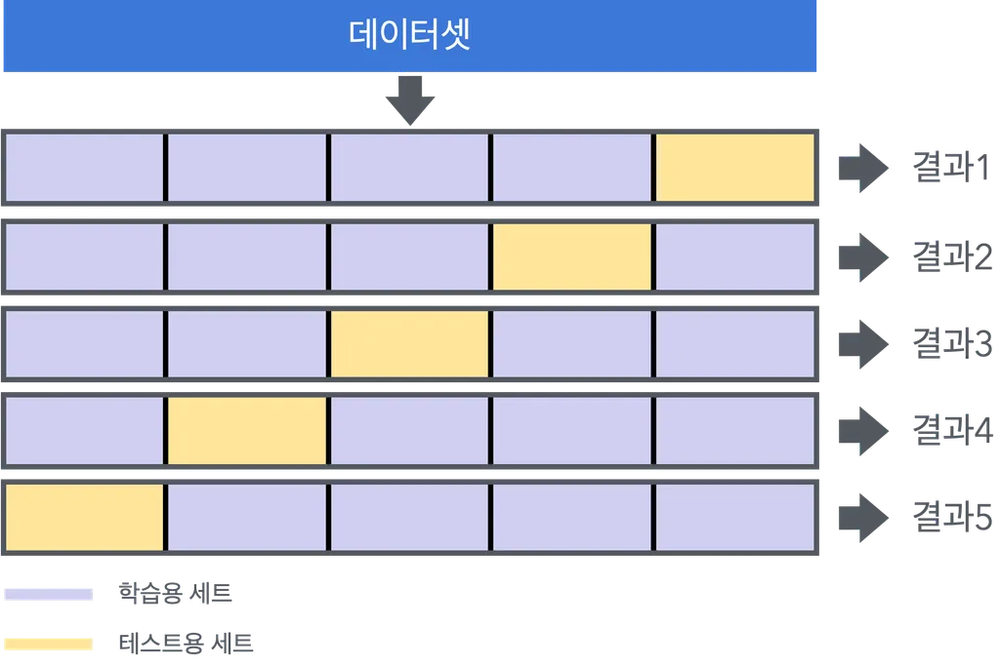

## [ 과적합 방지 기법 ]

### [ 정규화 ]

- 입력 데이터를 일정한 범위로 조정
- 모델 학습 안정화, 성능 향상
- **배치 정규화**
    - 각 미니배치의 평균, 분산 사용해 정규화
- **레이어 정규화**
    - 각 레이어의 뉴런 출력 정규화
    
&nbsp;
### [ 드롭아웃 ]

- 학습 과정에서 무작위로 뉴런 비활성화
- 학습 시에만 비활성화
- 평가 시에는 모든 뉴런 활성화
&nbsp;
### [ 조기 종료 ]

- 검증 데이터 성능 더 향상되지 않을 때 학습 중단
- 학습 과정에서 검증 손실이 일정 에포크 동안 감소하지 않으면 학습 중단
&nbsp;
### [ 데이터 증강 ]

- 원본 데이터 변형해 새로운 데이터 생성해 데이터 셋 확장
- 일반화 성능 향상
- 기법
    - 회전
    - 이동
    - 크기 조절
    - 색상 변환
&nbsp;
## [ 하이퍼파라미터 튜닝 ]

### **[ 하이퍼 파라미터 ]**

- 모델 학습 과정에서 사용자가 설정해야 하는 값
- **학습률**
    - 모델의 가중치 업데이트하는 속도
    - 너무 크면 학습 불안정, 너무 작으면 학습 느려짐
    - 0.1, 0.01, 0.001 …
- **배치 크기**
    - 한 번의 업데이트에 사용되는 데이터 샘플의 수
    - 너무 크면 학습 속도 높이지만 메모리 사용량 증가
    - 32, 64, 128 …
- **에포크 수**
    - 전체 데이터셋 몇 번 반복해 할습할지 결정
    - 너무 많으면 과적합 발생, 너무 적으면 과소적합 발생
    - *조기 종료* 기법으로 적절한 에포크 수 결정 가능
- **모멘텀**
    - 이전 기울기를 현재 기울기에 만영하는 정도
    - 0.9, 0.99 …
- **가중치 초기화**
    - 모델 가중치 초기화 하는 방법 결정
    - Xavier 초기화, He 초기화
&nbsp;
### [ 하이퍼파라미터 자동 튜닝 기법 ]

- **Grid Search**
    - 하이퍼파라미터의 모든 조합 시도해 최적의 값 찾음
    - 계산 비용 많이 듦
- **Random Search**
    - 하이퍼파라미터 공간에서 무작위로 값 선택해 최적의 값 찾음
    - 계산 비용이 적음
- **Bayesian Optimization**
    - 이전 평가 결과를 바탕으로 다음 평가할 하이퍼파라미터 선택
    - 계산 비용 적고 효율적
&nbsp;
## [ 모델 평가/검증과 Pytorch ]

### [ 교차검증 ]



- 모델의 일반화 성능 평가하기 위해 데이터 여러 번 나누어 학습, 검증 반복
- *필요성*
    - **과적합 방지**
    - 일반화 성능 평가
    - 높은 효율성
&nbsp;
### [ Pytorch ]

- 딥러닝 프레임워크
- 유연성, 사용 편의성 제공
- 1 ) 기본 모델 구축

```python
import torch.nn as nn

class MyModel(nn.Module):
    def __init__(self):
        super(MyModel, self).__init__()
        self.layer1 = nn.Linear(10, 20)

    def forward(self, x):
        x = self.layer1(x)
        return x
```
&nbsp;
- 2 ) 손실 함수
    - `torch.nn.CrossEntropyLoss` : 분류 문제에 주로 사용
    
    ```python
    loss_fn = nn.CrossEntropyLoss()`
    ```
    
    - `torch.nn.MSELoss` : 회귀 문제에 주로 사용
    
    ```python
    loss_fn = nn.MSELoss()
    ```
    &nbsp;
- 3 ) 최적화 알고리즘
    - `torch.optim.SGD`: 확률적 경사 하강법 최적화 알고리즘
        
        ```python
        optimizer = torch.optim.SGD(model.parameters(), lr=0.01)
        ```
        
    - `torch.optim.Adam`: Adam 최적화 알고리즘
        
        ```python
        optimizer = torch.optim.Adam(model.parameters(), lr=0.001)
        ```
        
&nbsp;
- 4 ) 데이터 로더
    - `torch.utils.data.DataLoader`: 미니 배치 학습을 위한 데이터 로더
    
    ```python
    from torch.utils.data import DataLoader
    
    dataset = MyDataset(data, targets)
    dataloader = DataLoader(dataset, batch_size=32, shuffle=True)
    ```
    
&nbsp;
- 5 ) 데이터 변환
    - `torchvision.transforms`: 이미지 데이터 변환을 위한 유틸리티
    
    ```python
    from torchvision import transforms
    
    transform = transforms.Compose([
        transforms.ToTensor(),
        transforms.Normalize((0.5,), (0.5,))
    ])
    ```
    
&nbsp;
- 6 ) GPU 설정 및 텐서 이동
    - 모델을 GPU로 이동
    
    ```python
    device = torch.device('cuda' if torch.cuda.is_available() else 'cpu')
    model.to(device)
    ```
    
    - 텐서를 GPU로 이동
    
    ```python
    inputs, targets = inputs.to(device), targets.to(device)
    ```
    
&nbsp;
- 7 ) 모델 기법별 API
    - *합성곱 신경망*
        - `torch.nn.Conv2d`: 2D 합성곱 레이어
        
        ```python
        conv_layer = nn.Conv2d(in_channels=1, out_channels=32, kernel_size=3, stride=1, padding=1)
        ```
        
    
    - *순환 신경망*
        - `torch.nn.RNN`: 기본 순환 신경망 레이어
        
        ```python
        rnn_layer = nn.RNN(input_size=10, hidden_size=20, num_layers=2, batch_first=True)
        ```
        
        - `torch.nn.LSTM`: LSTM 레이어
        
        ```python
        lstm_layer = nn.LSTM(input_size=10, hidden_size=20, num_layers=2, batch_first=True)
        ```
        
        - `torch.nn.GRU`: GRU 레이어
        
        ```python
        gru_layer = nn.GRU(input_size=10, hidden_size=20, num_layers=2, batch_first=True)
        ```
        
    &nbsp;
    - *트랜스포머*
        - `torch.nn.Transformer`: 트랜스포머 모델
        
        ```python
        transformer_model = nn.Transformer(nhead=8, num_encoder_layers=6)
        ```
        
        - `torch.nn.TransformerEncoderLayer`: 트랜스포머 인코더 레이어
        
        ```python
        encoder_layer = nn.TransformerEncoderLayer(d_model=512, nhead=8)
        ```
        
&nbsp;
- 8 ) 유틸리티 함수
    - 모델 저장
    
    ```python
    torch.save(model.state_dict(), 'model.pth')
    ```
    
    - 모델 로드
    
    ```python
    model.load_state_dict(torch.load('model.pth'))
    model.eval()
    ```
    

- 모델 학습 모드로 설정

```python
model.train()
```

- 모델 평가 모드로 설정

```python
model.eval()
```