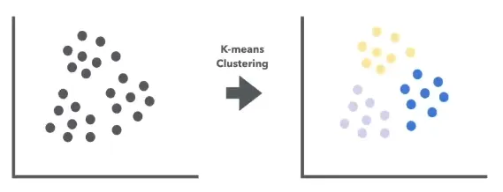
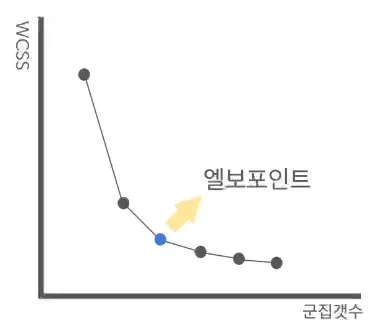

## [ 비지도 학습 ]

### [ 군집화 모델 : K-means ]



- 단계
    - 초기화 → 할당 → 업데이트 → 반복
- 거리 측정 방법 : 주로 *유클리드 거리* 사용
&nbsp;
- **최적의 K 값**
    - *엘보우 방법*
    

    
    → K 증가시키면서 각 K에 대한 군집의 응집도 계산 후, 그래프로 나타내 급격히 감소하는 부분을 찾음
&nbsp;  
- 군집분석 코드

```python
# 최적의 k 찾기 (엘보우 방법)
inertia = []
K = range(1, 11)
for k in K:
    kmeans = KMeans(n_clusters=k, random_state=42)
    kmeans.fit(data_scaled)
    inertia.append(kmeans.inertia_)

# 엘보우 그래프 그리기
plt.figure(figsize=(10, 8))
plt.plot(K, inertia, 'bx-')
plt.xlabel('k')
plt.ylabel('Inertia')
plt.title('Elbow Method For Optimal k')
plt.show()

# k=5로 모델 생성 및 학습
kmeans = KMeans(n_clusters=5, random_state=42)
kmeans.fit(data_scaled)

# 군집 결과 할당
data['Cluster'] = kmeans.labels_
```
&nbsp;
- 군집분석 결과 **시각화** 코드

```python
# 2차원으로 군집 시각화 (연령 vs 소득)
plt.figure(figsize=(10, 8))
sns.scatterplot(x=data['Age'], y=data['Annual Income (k$)'], hue=data['Cluster'], palette='viridis')
plt.title('Clusters of customers (Age vs Annual Income)')
plt.show()

# 2차원으로 군집 시각화 (소득 vs 지출 점수)
plt.figure(figsize=(10, 8))
sns.scatterplot(x=data['Annual Income (k$)'], y=data['Spending Score (1-100)'], hue=data['Cluster'], palette='viridis')
plt.title('Clusters of customers (Annual Income vs Spending Score)')
plt.show()
```
&nbsp;
&nbsp;
### [ 군집화 모델 : 계층적 군집화 ]

- 데이터 포인트를 점진적으로 병합/분할하여 군집 형성
- *종류*
    - **병합 군집화** : 각 데이터 프인트를 개별 군집으로 시작해 가장 가까운 군집을 반복적으로 병합
        - 구현 비교적 간단, 데이터 포인트 수 많아질 수록 계산 비용 증가
    - **분할 군집화** : 모든 데이터 포인트를 하나의 군집으로 가장 멀리 떨어진 군집을 반복적으로 분할
        - 구현 상대적으로 복잡, 큰 데이터셋에서 비교적 효율적
- *작동원리*
    - 거리행렬 계산
    - 군집 병합/분할
    - 덴드로그램 생성

- 코드

```python
# 계층적 군집화 모델 생성
hc = AgglomerativeClustering(n_clusters=5, metric='euclidean', linkage='ward')

# 모델 학습 및 예측
y_hc = hc.fit_predict(X_scaled)

# 결과 시각화
plt.figure(figsize=(10, 7))
plt.scatter(X_scaled[y_hc == 0, 0], X_scaled[y_hc == 0, 1], s=100, c='red', label='Cluster 1')
plt.scatter(X_scaled[y_hc == 1, 0], X_scaled[y_hc == 1, 1], s=100, c='blue', label='Cluster 2')
plt.scatter(X_scaled[y_hc == 2, 0], X_scaled[y_hc == 2, 1], s=100, c='green', label='Cluster 3')
plt.scatter(X_scaled[y_hc == 3, 0], X_scaled[y_hc == 3, 1], s=100, c='cyan', label='Cluster 4')
plt.scatter(X_scaled[y_hc == 4, 0], X_scaled[y_hc == 4, 1], s=100, c='magenta', label='Cluster 5')
plt.title('Clusters of customers')
plt.xlabel('Age')
plt.ylabel('Annual Income (k$)')
plt.legend()
plt.show()

# 모델 평가
from sklearn.metrics import silhouette_score

# 실루엣 점수 계산
silhouette_avg = silhouette_score(X_scaled, y_hc)
print(f'Silhouette Score: {silhouette_avg}')
```
&nbsp;
### [ 군집화 모델 : DBSCAN ]

- **밀도 기반** 군집화 알고리즘

: 데이터 밀도 높은 영역을 군집으로 묶고, 밀도 낮은 영역은 노이즈로 취급


- **장점**
    - 군집수 자동 결정 : 사전에 군집 개수 설정할 필요가 없음
    - 비구형 군집 탐지 가능
    - 노이즈 효과적으로 처리
- 코드

```python
from sklearn.cluster import DBSCAN
import matplotlib.pyplot as plt
import seaborn as sns

# DBSCAN 모델 생성
dbscan = DBSCAN(eps=5, min_samples=5)

# 모델 학습 및 예측
df['Cluster'] = dbscan.fit_predict(X)

# 군집화 결과 시각화
plt.figure(figsize=(10, 7))
sns.scatterplot(x='Annual Income (k$)', y='Spending Score (1-100)', hue='Cluster', data=df, palette='viridis')
plt.title('DBSCAN Clustering of Mall Customers')
plt.show()
```

—> eps(입실론) : 두 데이터 포인트 같은 군집에 속하기 위해 가져야 하는 최대 거리

—> min_samples : 한 군집을 형성하기 위해 필요한 최소 데이터 포인트 수